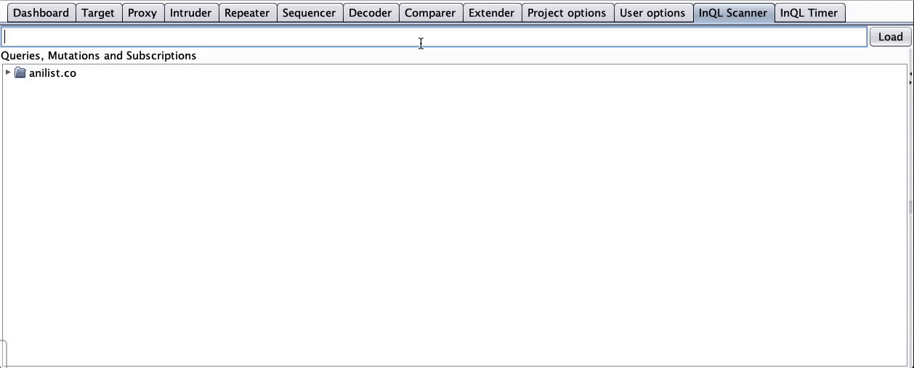
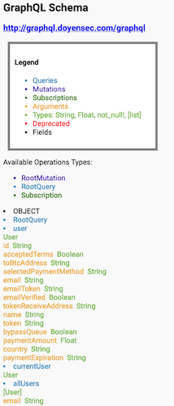
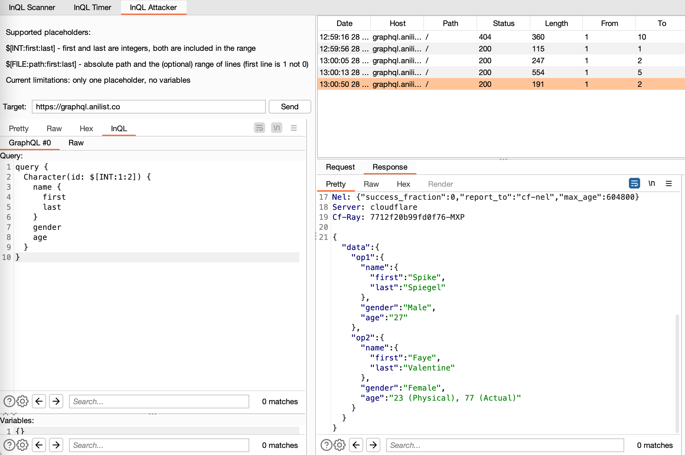

# InQL Scanner

> :warning: **Help needed!** :warning:
>
> Right now InQL is known to incorrectly parse certain GraphQL schemas and introspection query results.
>
> Please, help us make InQL better by reporting these issues [here](https://github.com/doyensec/inql/issues/new?assignees=execveat&labels=bug%2Cparsing&template=incorrectly_parsed_graphql_schema.yml&title=%5BImproper+parsing%5D%3A+). We will create a test suite and make sure that InQL parses all edge cases correctly, by the next major release.

A security testing tool to facilitate [GraphQL](https://graphql.org/) technology security auditing efforts.


InQL can be used as a stand-alone script or as a [Burp Suite](https://portswigger.net/burp) extension.

## InQL Burp Suite Extension

Since version 1.0.0 of the tool, InQL was extended to operate within Burp Suite. In this mode, the tool will retain all the stand-alone script capabilities and add a handy user interface for manipulating queries.

Using the `inql` extension for Burp Suite, you can:

- Search for known GraphQL URL paths; the tool will grep and match known values to detect GraphQL endpoints within the target website
- Search for exposed GraphQL development consoles (_GraphiQL_, _GraphQL Playground_, and other standard consoles)
- Use a custom GraphQL tab displayed on each HTTP request/response containing GraphQL
- Leverage the templates generation by sending those requests to Burp's Repeater tool ("Send to Repeater")
- Leverage the templates generation and editor support by sending those requests to embedded GraphIQL ("Send to GraphiQL")
- Configure the tool by using a custom settings tab


To use `inql` in Burp Suite, import the Python extension:

- Download the [Jython](https://www.jython.org/download) Jar
- Start Burp Suite
- Extender Tab > Options > Python Enviroment > Set the location of Jython standalone JAR
- Extender Tab > Extension > Add > Extension Type > Select Python
- Download the latest `inql_burp.py` release [here](https://github.com/doyensec/inql/releases)
- Extension File > Set the location of `inql_burp.py` > Next
- The output should now show the following message: `InQL Scanner Started!`

### Burp Extension Usage

Getting started with the `inql` Burp extension is easy:

1. Load a GraphQL endpoint or a JSON schema file location inside the top input field
2. Press the "Load" button
3. After a few seconds, the left panel will refresh, loading the directory structure for the selected endpoint as in the following example:

- url
- - query
- - - timestamp 1
- - - - query1.query
- - - - query2.query
- - - timestamp 2
- - - - query1.query
- - - - query2.query
- - mutation
- - subscription

4.  Selecting any _query_/_mutation_/_subscription_ will load the corresponding template in the main text area

## Features

### Burp GraphQL Query Timer

Since version 3.0.0, InQL has an integrated Query Timer.
This Query Timer is a reimagination of [Request Timer](https://github.com/PortSwigger/request-timer), which can filter for query name and body.

The Query Timer is enabled by default and especially useful in conjunction with the Cycles detector. A tester can switch between graphql-editor modes (Repeater and GraphIQL) to identify [DoS queries](https://www.diva-portal.org/smash/get/diva2:1302887/FULLTEXT01.pdf). Query Timer demonstrates the ability to attack such vulnerable graphql endpoints by counting the execution time of each and every query.



### InQL Documentation Generator

In either BURP or Stand-Alone mode, InQL can generate meaningful documentation for available GraphQL entities.
Results are available as HTML pages or query templates.

The resulting HTML documentation page will contain details for all available `Queries`, `Mutations`, and `Subscriptions` as shown here:



The following screenshot shows the use of templates generation:


### InQL Precise Queries

Based on InQL's introspection intermediate representation (IIR), the tool is able to generate arbitrarily nested queries with support to
any scalar type, enumerations, arrays, and objects.

```javascript
query {
  Character(id_not_in:[1334], sort:[ROLE_DESC], search:"code", id_not:1334, id:1334, id_in:[1334]) {
    image {
      large
    }
    siteUrl
    favourites
    modNotes
    description(asHtml:true)
    media(sort:[TITLE_ROMAJI], type:ANIME, perPage:1334, page:1334) {
      edges {
        isMainStudio
      }
    }
    name {
      last
    }
    id
    isFavourite
    updatedAt
  }
}
```

While this enables seamless "Send to Repeater" functionality from the Scanner to the other tool components (Repeater and GraphiQL console), it is still not possible for the tool to infer placeholders for [GraphQL Custom Scalars](https://hasura.io/docs/1.0/graphql/core/actions/types/index.html#custom-scalars).

### InQL Cycles Detector

The new introspection intermediate representation (IIR) allows to inspect for cycles in defined graphql schemas by requiring access to graphql introspection-enabled endpoint only.

This functionality is especially useful and automates bothersome testing practices employing graph solving algorithm. In our test, the tool was able to find millions of cycles in a matter of minutes.

### InQL Batch Attacker

A new "InQL Attacker" tab introduces batch attack functionality:



Replace query argument with a placeholder and InQL will generate batch attack request. For example this request:

```graphql
query {
	Character(id: $[INT:1:2]) {
		name {
			first
			last
		}
		gender
		age
	}
}
```

will get converted into:

```
query {
 	op1: Character(id: 1) {
		name {
			first
			last
		}
		gender
		age
	}
	op2: Character(id: 2) {
		name {
			first
			last
		}
		gender
		age
	}
}
```

Support for multiple parameters, rate-limit detection and bypass, GraphQL variables is planned in later InQL versions. Other ideas and feature requests [are welcome](https://github.com/doyensec/inql/issues/new?assignees=&labels=&template=feature_request.md&title=)!

## InQL Stand-Alone Version

InQL can be used without Burp in two ways:

1. CLI version, does not require Jython and should work with CPython / PyPy
2. GUI version, requires Jython

### Stand-Alone CLI

Running `inql` from Python will issue an [Introspection](https://graphql.org/learn/introspection/) query to the target GraphQL endpoint in order fetch metadata information for:

- Queries, mutations, subscriptions
- Its fields and arguments
- Objects and custom object types
- Cycles inside the graphql definition

InQL can inspect the introspection query results and generate clean documentation in different formats such as
HTML and JSON schema. InQL is also able to generate templates (with optional placeholders) for all known basic data types.

For all supported options, check the command line help:

```
usage: inql [-h] [-t TARGET] [-f SCHEMA_JSON_FILE] [-k KEY] [-p PROXY]
            [--header HEADERS HEADERS] [-d] [--no-generate-html]
            [--no-generate-schema] [--no-generate-queries] [--generate-cycles]
            [--cycles-timeout CYCLES_TIMEOUT] [--cycles-streaming]
            [--generate-tsv] [--insecure] [-o OUTPUT_DIRECTORY]

InQL Scanner

optional arguments:
  -h, --help            show this help message and exit
  -t TARGET             Remote GraphQL Endpoint (https://<Target_IP>/graphql)
  -f SCHEMA_JSON_FILE   Schema file in JSON format
  -k KEY                API Authentication Key
  -p PROXY              IP of a web proxy to go through
                        (http://127.0.0.1:8080)
  --header HEADERS HEADERS
  -d                    Replace known GraphQL arguments types with placeholder
                        values (useful for Burp Suite)
  --no-generate-html    Generate HTML Documentation
  --no-generate-schema  Generate JSON Schema Documentation
  --no-generate-queries
                        Generate Queries
  --generate-cycles     Generate Cycles Report
  --cycles-timeout CYCLES_TIMEOUT
                        Cycles Report Timeout (in seconds)
  --cycles-streaming    Some graph are too complex to generate cycles in
                        reasonable time, stream to stdout
  --generate-tsv        Generate TSV representation of query templates. It may
                        be useful to quickly search for vulnerable I/O.
  --insecure            Accept any SSL/TLS certificate
  -o OUTPUT_DIRECTORY   Output Directory
```

### Stand-Alone GUI

Since version 2.0.0, InQL UI is able to operate without requiring BURP.
It is now possible to install InQL stand-alone for `jython` and run the Scanner UI.

In this mode, InQL maintains most of the Burp Scanner capabilities except for advanced
interactions such as "Send To Repeater" and automatic authorization header generation, available through BURP.

To use `inql` stand-alone UI:

- Download and Install [Jython](https://www.jython.org/download). Jython can be obtained on macOS through brew `brew install jython` or on Ubuntu derivates through `apt-get install -y jython`
- Download inql `git clone https://github.com/doyensec/inql`
- Change directory to inql with `cd inql`
- Start the UI through jython with `jython -m inql`

NDR: At the current stage Jython does not support HTTP/2. Any request to an HTTP/2 server will fail silently.
We advise to use the Burp to bypass this limitation temporarily.

# Credits

_Author and original maintainer:_ Andrea Brancaleoni ([@nJoyneer](https://twitter.com/nJoyneer) - [thypon](https://github.com/thypon))
_Current maintainer:_ Andrew Konstantinov ([@execveat](https://infosec.exchange/@execveat))

This project was made with love in [Doyensec Research island](https://doyensec.com/research.html).
